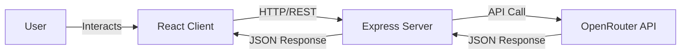

# System Design: VisMinds

## 1. Architecture Overview
The application follows a standard **Client-Server Architecture**.

-   **Frontend (Client)**: A Single Page Application (SPA) built with React and Vite. It handles user interactions, state management, and renders the UI.
-   **Backend (Server)**: A RESTful API built with Node.js and Express. It acts as an intermediary between the client and external AI services (OpenRouter).
-   **External Services**: OpenRouter API for Large Language Model (LLM) inference.

## 2. Key Components

### 2.1. Frontend Components
-   **Layout/Sidebar**: Manages global navigation and responsive structure.
-   **Dashboard**: Overview of recent activity and quick actions.
-   **TheCouncil.jsx**:
    -   **State**: `topic` (string), `selectedPersonas` (array), `discussion` (array).
    -   **UI**:
        -   **PersonaSelector**: Grid of clickable cards for selecting advisors.
        -   **ChatInterface**: Displays the generated "Meeting Minutes" in a script format.
        -   **Motion**: Uses `framer-motion` for smooth entry animations of chat bubbles.

### 2.2. Backend Logic (`aiController.js`)
-   **`generateCouncilDiscussion`**:
    -   **Input**: `topic`, `personas` (list of strings).
    -   **Prompt Engineering**: Constructs a "System Prompt" that defines the role of a "Moderator" and the distinct personalities of the selected board members.
    -   **Output Parsing**: Requests JSON output from the LLM to ensure the frontend can render structured data (Speaker, Content, Sentiment).

## 3. Data Flow: "The Council" Feature

1.  **User Action**: User navigates to `/the-council`, selects "The Skeptic" and "The Visionary", enters "Launch a coffee brand", and clicks "Convene".
2.  **Client Request**: POST `/api/ai/council` with body `{ topic: "...", personas: [...] }`.
3.  **Server Processing**:
    -   Server receives request.
    -   Constructs prompt: *"Simulate a debate between The Skeptic and The Visionary about launching a coffee brand..."*
    -   Calls OpenRouter API.
4.  **AI Generation**: Model generates a JSON array representing the dialogue.
5.  **Response**: Server sends parsed JSON back to Client.
6.  **Rendering**: Client maps over the JSON array and displays each dialogue item with the corresponding persona's avatar and color theme.

## 4. UI/UX Design System
-   **Theme**: Dark mode with vibrant accents (Purple/Primary, Cyan/Secondary).
-   **Typography**: Inter (Modern sans-serif).
-   **Visuals**:
    -   **Glassmorphism**: Translucent card backgrounds (`bg-card`, `backdrop-blur`).
    -   **Gradients**: Text gradients for headings to imply premium quality.
    -   **Micro-interactions**: Hover effects on cards and buttons.

## 5. Future Scalability
-   **Database**: Currently stateless. Future version could add MongoDB to save "Meeting Minutes" and user history.
-   **User Auth**: Add authentication to save preferences and custom personas.
-   **Streaming**: Implement server-sent events (SSE) for real-time text streaming of the debate.
